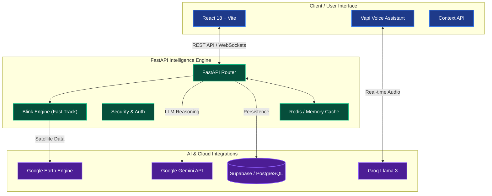

# Build-With-AI (KrishiAI: Intelligence for the Next Billion Farmers)

<p align="center">
  
</p>

<p align="center">
  
</p>

> **Empowering agriculture through real-time satellite intelligence, hyper-local market discovery, and multi-modal AI diagnostics.**

KrishiAI is a high-performance, full-stack intelligence platform designed to bridge the gap between advanced geospatial data and the everyday farmer. By leveraging Google Earth Engine and our proprietary "Blink Engine" progressive hydration model, KrishiAI delivers critical crop health metrics in under 4 seconds.

---

## 🏗️ System Architecture

Our platform leverages a modern, serverless-first architecture optimized for high concurrency and low latency.



---

## 🚀 The Blink Engine: Sub-4s Satellite Intelligence

Traditional satellite analysis takes minutes. KrishiAI's **Blink Engine** solves this latency gap through:
- **Fast Track**: Delivers current NDVI and weather data in **<3 seconds** using server-side optimizations.
- **Deep Track**: Seamlessly background-loads historical trends and 10m-resolution soil moisture.
- **Warm Boot**: Authentication with Google Cloud occurs at startup, eliminating one-time latency for every query.

<p align="center">
  
</p>

---

## 🛠️ Core Modules

<div align="center">
  <table>
    <tr>
      <td width="50%">
        <h3>📡 Satellite Intel (GEE)</h3>
        Real-time crop health monitoring using Sentinel-2 and NASA SMAP datasets. 10m spatial resolution for precision farming.
      </td>
      <td width="50%">
        <h3>🎙️ Real-time Voice AI</h3>
        Hyper-localized farming advice via a high-fidelity voice interface powered by Vapi, Groq, and Gemini.
      </td>
    </tr>
    <tr>
      <td width="50%">
        <h3>📍 Mandi Map</h3>
        Tactical mapping for finding the best prices at nearby government mandis with direct API integration.
      </td>
      <td width="50%">
        <h3>👥 Community & Diagnostics</h3>
        Instant disease identification using visual AI models and peer-to-peer knowledge hubs.
      </td>
    </tr>
  </table>
</div>

---

## 💻 Tech Stack

<div align="center">
  
  
  
  
  
</div>

---

## ⚙️ Getting Started

### 1. Quick Setup
```bash
# Clone the repository
git clone https://github.com/Manav373/Build-With-AI.git
cd Build-With-AI

# Start the Intelligence Engine (Backend)
cd backend 
pip install -r requirements.txt
uvicorn app.main:app --reload

# Start the Frontend
cd ../frontend
npm install
npm run dev
```

### 2. Environment Configuration

Create a `.env` in the `backend/` directory using our template:
```bash
cp backend/.env.example backend/.env
```
Fill in your API keys for Gemini, Groq, Google Maps, and other services.

---

## 🌍 Social Impact

KrishiAI is built to reduce the information asymmetry in rural farming communities, providing high-fidelity data that was previously only accessible to industrial combines.

<p align="center">
  <i>Built with ❤️ for the Next Billion Users.</i>
</p>
