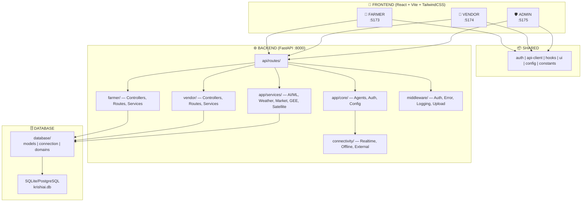

# 🌾 KrishiAI — Complete Project Structure

> **One file. Everything mapped.** Use `Ctrl+F` to find anything instantly.

---

## 📋 Table of Contents

1. [High-Level Overview](#-high-level-overview)
2. [Root Files](#-root-files)
3. [Frontend — FARMER + VENDOR + ADMIN](#-frontend)
4. [Backend — FastAPI Python Server](#-backend)
5. [Database Layer](#-database-layer)
6. [Shared Frontend Packages](#-shared-frontend-packages)
7. [Infrastructure & DevOps](#-infrastructure--devops)
8. [Documentation](#-documentation)
9. [Scripts & Automation](#-scripts--automation)
10. [Quick Reference Cheatsheet](#-quick-reference-cheatsheet)

---

## 🏗 High-Level Overview

```
krishiai/
│
├── 🎨 FRONTEND
│   └── frontend/
│       ├── farmer/      ← Farmer web app       (React + Vite, port 5173)
│       ├── vendor/      ← Vendor web app       (React + Vite, port 5174)
│       └── admin/       ← Admin dashboard      (React + Vite, port 5175)
│
├── ⚙️ BACKEND
│   └── backend/         ← FastAPI server        (Python 3.11+, port 8000)
│       ├── api/         ← API route handlers
│       ├── app/         ← Core app, AI/ML services, agents
│       ├── farmer/      ← Farmer domain (controllers, routes, services)
│       ├── vendor/      ← Vendor domain (controllers, routes, services)
│       ├── database/    ← ORM models, connections, domain queries
│       ├── middleware/  ← Auth, error, logging, upload
│       └── connectivity/← Realtime, offline-sync, external connectors
│
├── 🗄️ DATABASE
│   └── DATABASE/        ← Schema docs, connection specs, design docs
│
├── 📦 SHARED/           ← Shared frontend code (auth, api-client, hooks, UI)
├── 🐳 INFRASTRUCTURE/   ← Docker, Nginx, deployment
├── 📚 DOCS/             ← Architecture, API, migration, testing docs
└── 🔧 SCRIPTS/          ← Monorepo automation scripts
```

### Architecture Diagram



---

## 📄 Root Files

| File | Purpose |
|------|---------|
| `package.json` | Monorepo root — workspace scripts (`dev:farmer`, `dev:vendor`, etc.) |
| `pnpm-workspace.yaml` | pnpm workspace linking FARMER, VENDOR, ADMIN, SHARED |
| `vercel.json` | Vercel deployment rewrites for all frontends + API |
| `Dockerfile` | Root Docker build for the backend |
| `.env` | Global environment variables (API keys, DB URL, etc.) |
| `.gitignore` | Git ignore rules |
| `.dockerignore` / `.gcloudignore` | Docker & GCloud deploy ignore rules |
| `README.md` | Project overview & getting started |
| `START_LOCAL.md` | Step-by-step local development guide |
| `BEST_PRACTICES_STRUCTURE.md` | Code organization best practices |
| `project_brief_template.md` | Hackathon project brief template |

---

## 🎨 FRONTEND

> All three frontend apps share the same stack: **React 18 + Vite + TailwindCSS**.
> They consume shared code from `SHARED/` via pnpm workspaces.

---

### 🌾 frontend/farmer/ — Farmer Web App (port 5173)

> AI crop diagnosis, satellite analytics, weather, market prices, voice assistant, WhatsApp, community.

```
frontend/farmer/
├── index.html                          ← Entry HTML
├── package.json                        ← Deps & scripts
├── vite.config.js                      ← Vite config (port 5173)
├── tailwind.config.js                  ← Tailwind config
├── postcss.config.js                   ← PostCSS
├── .env / .env.example                 ← Environment variables
├── README.md
├── public/                             ← Static assets
├── dist/                               ← Build output
│
└── src/
    ├── App.jsx                         ← Root component + router
    ├── main.jsx                        ← Entry point + providers
    ├── index.css                       ← Global styles
    │
    ├── pages/                          ← 📄 Page Components (22 files)
    │   ├── index.js                    ← Barrel exports
    │   ├── LandingPage.jsx             ← Home / Landing
    │   ├── SignInPage.jsx              ← Login
    │   ├── SignUpPage.jsx              ← Registration
    │   ├── PredictPage.jsx             ← 🧠 AI crop prediction
    │   ├── RecommendPage.jsx           ← 🧠 AI crop recommendations
    │   ├── SatellitePage.jsx           ← 🛰️ Satellite imagery + GEE
    │   ├── FarmerAnalytics.jsx         ← 📊 Dashboard analytics
    │   ├── FarmerHeatmap.jsx           ← 🗺️ Geographical heatmap
    │   ├── MarketPricePage.jsx         ← 💰 Mandi market prices
    │   ├── MandiMapPage.jsx            ← 📍 Mandi location map
    │   ├── ChatPage.jsx               ← 💬 AI chatbot
    │   ├── VoiceAssistantPage.jsx      ← 🎤 Vapi voice AI
    │   ├── WhatsAppPage.jsx            ← 📱 WhatsApp integration
    │   ├── CallHistoryPage.jsx         ← 📞 Call history
    │   ├── CommunityPage.jsx           ← 👥 Community forum
    │   ├── SchemesPage.jsx             ← 🏛️ Govt. schemes
    │   ├── SettingsPage.jsx            ← ⚙️ Settings
    │   ├── HelpPage.jsx               ← ❓ Help center
    │   ├── PrivacyPage.jsx             ← Privacy policy
    │   ├── TermsPage.jsx               ← Terms of service
    │   └── FarmerBrowseRequirementsPage.jsx ← Browse vendor requirements
    │
    ├── components/                     ← 🧩 Reusable Components (28+ files)
    │   ├── index.js                    ← Barrel exports
    │   ├── Navbar.jsx                  ← Navigation bar
    │   ├── Footer.jsx                  ← Footer
    │   ├── Hero.jsx                    ← Hero section
    │   ├── Features.jsx               ← Features showcase
    │   ├── HowItWorks.jsx             ← How it works
    │   ├── ScrollJourney.jsx           ← Scroll animation journey
    │   ├── CTA.jsx                     ← Call to action
    │   ├── FAQ.jsx                     ← FAQ section
    │   ├── Stats.jsx                   ← Statistics
    │   ├── Impact.jsx                  ← Impact metrics
    │   ├── Mission.jsx                 ← Mission statement
    │   ├── Partners.jsx               ← Partner logos
    │   ├── Testimonials.jsx            ← Testimonials
    │   ├── Preloader.jsx               ← Loading animation
    │   ├── CustomCursor.jsx            ← Custom cursor
    │   ├── ScrollToTop.jsx             ← Scroll-to-top
    │   ├── MarqueeTicker.jsx           ← Scrolling ticker
    │   ├── DomainSwitcherBar.jsx       ← Farmer ↔ Vendor switch
    │   ├── FeaturePhone.jsx            ← Feature phone support
    │   ├── ChatWindow.jsx              ← Chat UI
    │   ├── MessageInput.jsx            ← Chat message input
    │   ├── MandiMap.jsx                ← Interactive mandi map (Leaflet)
    │   ├── PriceTrendChart.jsx         ← Price chart
    │   ├── VapiCall.jsx                ← Voice call widget
    │   ├── WeatherAnalysisModal.jsx    ← Weather modal
    │   ├── LocationPermissionPopup.jsx ← Location popup
    │   ├── RoleSelectionModal.jsx      ← Role selection
    │   ├── common/                     ← Small shared components
    │   ├── feature/                    ← Feature-specific
    │   ├── landing/                    ← Landing page sections
    │   ├── layout/                     ← Layout wrappers
    │   └── ui/                         ← Primitive UI elements
    │
    ├── context/                        ← ⚡ React Context Providers (9 files)
    │   ├── index.js
    │   ├── AuthContext.jsx             ← Auth state
    │   ├── ChatContext.jsx             ← Chat state
    │   ├── LanguageContext.jsx         ← Language / i18n
    │   ├── LocationContext.jsx         ← Geolocation
    │   ├── MobileMenuContext.jsx       ← Mobile menu
    │   ├── ThemeContext.jsx            ← Dark/Light theme
    │   ├── UserRoleContext.jsx         ← User role
    │   └── VoiceAssistantContext.jsx   ← Voice assistant
    │
    ├── hooks/                          ← 🪝 Custom Hooks
    │   ├── useAuthenticatedApi.js      ← Auth API calls
    │   ├── useSafeAuth.js              ← Safe auth
    │   └── useWindowSize.js            ← Window resize
    │
    ├── services/                       ← 🔌 API Service
    │   └── api.js                      ← Axios API client
    │
    ├── routes/                         ← 🛤️ Routes
    │   └── farmerRoutes.jsx            ← All farmer routes
    │
    ├── layouts/                        ← 📐 Layouts
    │   ├── MainLayout.jsx              ← Main layout
    │   └── DashboardSidebar.jsx        ← Sidebar navigation
    │
    ├── assets/                         ← 🖼️ Images, icons
    ├── shared/                         ← Local shared utils
    ├── store/                          ← State management (WIP)
    ├── styles/                         ← Additional CSS
    └── utils/                          ← Utility functions
```

---

### 🏪 frontend/vendor/ — Vendor Web App (port 5174)

> Vendor/merchant dashboard: products, procurement, logistics, warehouse, payments, marketplace, AI quality.

```
frontend/vendor/
├── index.html
├── package.json
├── vite.config.js                      ← port 5174
├── tailwind.config.js
├── postcss.config.js
├── .env / .env.example
├── README.md
├── public/ | dist/
│
└── src/
    ├── App.jsx | main.jsx | index.css
    │
    ├── pages/                          ← 📄 Vendor Pages (30 files)
    │   ├── index.js
    │   ├── VendorDashboardHome.jsx     ← 🏠 Dashboard overview
    │   ├── VendorDashboardLayout.jsx   ← Dashboard shell
    │   ├── VendorTypeSelectionPage.jsx ← Type selection
    │   ├── VendorSignUpPage.jsx        ← Registration
    │   ├── VendorOnboardingPage.jsx    ← Onboarding wizard
    │   ├── VendorCompanyProfilePage.jsx← Company profile
    │   ├── VendorProfilePage.jsx       ← Personal profile
    │   ├── VendorProductsPage.jsx      ← 📦 Product catalog CRUD
    │   ├── VendorMarketplacePage.jsx   ← 🏪 Public marketplace
    │   ├── VendorRequirementsPage.jsx  ← 📋 Procurement requirements
    │   ├── VendorInventoryPage.jsx     ← 📊 Inventory management
    │   ├── VendorWarehousePage.jsx     ← 🏭 Warehouse management
    │   ├── VendorLogisticsPage.jsx     ← 🚚 Shipping & logistics
    │   ├── VendorPickupPage.jsx        ← 📍 Pickup scheduling
    │   ├── VendorPaymentsPage.jsx      ← 💳 Payments
    │   ├── VendorCustomerOrdersPage.jsx← Customer orders
    │   ├── VendorProcurementOrdersPage.jsx ← Procurement orders
    │   ├── VendorNegotiationPage.jsx   ← 🤝 Price negotiation
    │   ├── VendorTendersPage.jsx       ← 📜 Tenders
    │   ├── VendorApplicationsPage.jsx  ← Applications
    │   ├── VendorPromotionsPage.jsx    ← 🎯 Promotions
    │   ├── VendorAnalyticsPage.jsx     ← 📈 Business analytics
    │   ├── VendorAIQualityPage.jsx     ← 🧠 AI quality check
    │   ├── VendorNotificationsPage.jsx ← 🔔 Notifications
    │   ├── VendorReviewsPage.jsx       ← ⭐ Reviews
    │   ├── VendorSettingsPage.jsx      ← ⚙️ Settings
    │   ├── VendorDocumentsPage.jsx     ← 📄 Documents
    │   ├── VendorAdminPage.jsx         ← Admin panel
    │   └── VendorDashboardPlaceholder.jsx ← Placeholder
    │
    ├── components/                     ← 🧩 Vendor Components
    │   ├── VendorLoginModal.jsx        ← Login modal
    │   ├── VendorProfile.jsx           ← Profile component
    │   ├── sampleVendorData.js         ← Mock data
    │   ├── common/                     ← Shared components
    │   └── vendor/                     ← Vendor-specific
    │
    ├── context/                        ← ⚡ Context Providers (8 files)
    │   ├── index.js
    │   ├── ChatContext.jsx
    │   ├── LanguageContext.jsx
    │   ├── LocationContext.jsx
    │   ├── MobileMenuContext.jsx
    │   ├── ThemeContext.jsx
    │   ├── UserRoleContext.jsx
    │   └── VoiceAssistantContext.jsx
    │
    ├── services/                       ← 🔌 API Service
    │   └── api.js
    │
    ├── routes/                         ← 🛤️ Routes
    │   └── vendorRoutes.jsx
    │
    ├── hooks/                          ← (empty / WIP)
    ├── layouts/                        ← (empty / WIP)
    ├── store/                          ← (empty / WIP)
    ├── styles/
    ├── assets/
    └── utils/
```

---

### 🛡️ frontend/admin/ — Admin Dashboard (port 5175)

> System admin: user management, vendor verification, order monitoring, complaints, audit logs.

```
frontend/admin/
├── index.html
├── package.json
├── vite.config.js                      ← port 5175
├── tailwind.config.js | postcss.config.js
├── .env / .env.example
├── public/ | dist/
│
└── src/
    ├── App.jsx | main.jsx | index.css
    │
    ├── pages/                          ← 📄 Admin Pages (8 files)
    │   ├── AdminDashboard.jsx          ← 🏠 Main dashboard
    │   ├── AdminUsersPage.jsx          ← 👥 User management
    │   ├── AdminVendorVerificationPage.jsx ← ✅ Vendor verification
    │   ├── AdminOrdersPage.jsx         ← 📦 Order monitoring
    │   ├── AdminProductModerationPage.jsx ← 🛡️ Product moderation
    │   ├── AdminComplaintsPage.jsx     ← 📢 Complaints
    │   ├── AdminSchemesPage.jsx        ← 🏛️ Scheme management
    │   └── AdminAuditLogsPage.jsx      ← 📋 Audit logs
    │
    ├── layouts/
    │   └── AdminLayout.jsx             ← Admin shell + sidebar
    │
    └── routes/
```

---

## ⚙️ BACKEND

> **FastAPI (Python 3.11+)** — Single backend serving all three frontends.
> Handles: Auth, AI/ML, Satellite, Weather, Market, Voice, WhatsApp, Vendor CRUD, Database.

```
backend/
├── server.py                           ← 🚀 Uvicorn entry point
├── __init__.py
├── requirements.txt                    ← Python dependencies
├── Dockerfile                          ← Backend Docker build
├── .env / .env.example                 ← Environment variables
├── .gcloudignore
├── backend_super_details.md            ← Detailed backend docs
├── krishiai.db                         ← SQLite database file
│
│
│ ╔══════════════════════════════════════════════════════════════╗
│ ║  app/ — Core Application (main entry, agents, AI services)  ║
│ ╚══════════════════════════════════════════════════════════════╝
│
├── app/
│   ├── __init__.py
│   ├── main.py                         ← 🏠 FastAPI app, CORS, route registration
│   │
│   ├── core/                           ← ⚙️ Core Config & AI Agents
│   │   ├── config.py                   ← Environment config loader
│   │   ├── auth.py                     ← Firebase auth verification
│   │   ├── agent.py                    ← 🧠 Main Gemini AI agent
│   │   ├── web_agent.py               ← Web-specific AI agent
│   │   └── whatsapp_agent.py          ← WhatsApp AI agent
│   │
│   ├── services/                       ← 🧠 ALL AI/ML & Business Services
│   │   │
│   │   │  ── AI & Machine Learning ──
│   │   ├── ml_model.py                 ← ML model training & prediction
│   │   ├── train_model.py              ← Full training pipeline
│   │   ├── train_model_lite.py         ← Lightweight training
│   │   ├── explain_prediction.py       ← Prediction explainability
│   │   ├── dataset_builder.py          ← Dataset generation
│   │   │
│   │   │  ── Crop Intelligence ──
│   │   ├── crop_advice.py              ← AI crop advisory
│   │   ├── crop_calendar.py            ← Crop scheduling
│   │   ├── crop_planner.py             ← Multi-season planning
│   │   ├── crop_simulator.py           ← Growth simulation
│   │   ├── disease.py                  ← Disease detection (Gemini Vision)
│   │   ├── pest.py                     ← Pest identification
│   │   ├── yield_estimation.py         ← Yield prediction
│   │   │
│   │   │  ── Earth & Environment ──
│   │   ├── weather.py                  ← Weather forecasting
│   │   ├── weather_scenarios.py        ← Scenario analysis
│   │   ├── satellite.py                ← Satellite imagery
│   │   ├── satellite_health_model.py   ← Satellite crop health
│   │   ├── pixel_analyzer.py           ← Pixel-level analysis
│   │   ├── gee_service.py              ← Google Earth Engine
│   │   ├── soil.py                     ← Soil analysis
│   │   ├── irrigation.py               ← Irrigation recommendations
│   │   │
│   │   │  ── Market & Data ──
│   │   ├── market.py                   ← Mandi prices & trends
│   │   ├── scheme.py                   ← Govt. schemes lookup
│   │   ├── fetch_real_data.py          ← External data fetching
│   │   ├── location_service.py         ← Geolocation services
│   │   │
│   │   │  ── Auth & Communication ──
│   │   ├── auth_service.py             ← Authentication service
│   │   ├── sms_service.py              ← SMS / Twilio
│   │   ├── pii.py                      ← PII detection & masking
│   │   │
│   │   ├── data/                       ← Training data files
│   │   └── model/                      ← Saved ML model files (.pkl, etc.)
│   │
│   ├── models/                         ← 📦 Pydantic Request/Response Models
│   │   ├── vendor.py                   ← Vendor schemas
│   │   ├── market.py                   ← Market schemas
│   │   ├── location.py                 ← Location schemas
│   │   ├── community_model.py          ← Community schemas
│   │   └── vapi_model.py               ← Vapi schemas
│   │
│   ├── utils/                          ← 🔧 Utilities
│   │   ├── ai_utils.py                 ← Gemini helper utils
│   │   ├── memory.py                   ← Conversation memory
│   │   ├── seed_data.py                ← Database seed data
│   │   └── speech.py                   ← TTS utilities
│   │
│   └── db/                             ← App-level DB config
│       └── database.py                 ← SQLAlchemy engine & session
│
│
│ ╔══════════════════════════════════════════════════════════════╗
│ ║  api/ — API Route Layer (all endpoint handlers)              ║
│ ╚══════════════════════════════════════════════════════════════╝
│
├── api/
│   ├── __init__.py
│   ├── index.py                        ← Router aggregator
│   ├── requirements.txt
│   │
│   └── routes/                         ← 🛤️ All API Endpoints
│       ├── auth.py                     ← POST /auth/login, /auth/register
│       ├── ml.py                       ← POST /predict, /recommend, /train
│       ├── web.py                      ← POST /chat, /analyze-image
│       ├── whatsapp.py                 ← POST /whatsapp/webhook
│       ├── vapi.py                     ← POST /vapi/webhook, /vapi/call
│       ├── sms.py                      ← POST /sms/send
│       ├── community.py                ← GET/POST /community/posts
│       ├── schemes.py                  ← GET /schemes
│       ├── location.py                 ← GET /location, /mandi-near
│       ├── mcp.py                      ← MCP server endpoints
│       └── vendor.py                   ← 🏪 ALL vendor CRUD routes
│
│
│ ╔══════════════════════════════════════════════════════════════╗
│ ║  farmer/ & vendor/ — Domain Modules                          ║
│ ╚══════════════════════════════════════════════════════════════╝
│
├── farmer/                             ← 🌾 Farmer Domain
│   ├── controllers/                    ← Request handlers
│   │   ├── crop_controller.py
│   │   ├── market_controller.py
│   │   ├── ml_controller.py
│   │   ├── schemes_controller.py
│   │   └── vapi_controller.py
│   │
│   ├── routes/                         ← Route definitions
│   │   ├── community.py
│   │   ├── location.py
│   │   ├── ml.py
│   │   ├── schemes.py
│   │   ├── vapi.py
│   │   ├── web.py
│   │   └── whatsapp.py
│   │
│   ├── services/                       ← Business logic (mirrors app/services)
│   │   ├── auth_service.py
│   │   ├── crop_advice.py | crop_calendar.py | crop_planner.py | crop_simulator.py
│   │   ├── disease.py | pest.py | yield_estimation.py
│   │   ├── weather.py | weather_scenarios.py
│   │   ├── satellite.py | satellite_health_model.py | pixel_analyzer.py
│   │   ├── gee_service.py | soil.py | irrigation.py
│   │   ├── market.py | scheme.py | location_service.py
│   │   ├── ml_model.py | explain_prediction.py | dataset_builder.py
│   │   ├── train_model.py | train_model_lite.py
│   │   ├── fetch_real_data.py | sms_service.py | pii.py
│   │   ├── data/                       ← Training data
│   │   └── model/                      ← Saved models
│   │
│   ├── serializers/
│   ├── utils/
│   └── validators/
│
├── vendor/                             ← 🏪 Vendor Domain
│   ├── controllers/
│   │   ├── vendor_controller.py        ← Main vendor operations
│   │   ├── product_controller.py       ← Product CRUD
│   │   ├── order_controller.py         ← Order management
│   │   └── requirement_controller.py   ← Procurement requirements
│   │
│   ├── routes/
│   │   └── vendor.py                   ← All vendor routes
│   │
│   ├── services/                       ← (empty / WIP)
│   ├── serializers/
│   ├── utils/
│   └── validators/
│
│
│ ╔══════════════════════════════════════════════════════════════╗
│ ║  middleware/ — Request Processing Pipeline                   ║
│ ╚══════════════════════════════════════════════════════════════╝
│
├── middleware/
│   ├── __init__.py                     ← Middleware registration
│   ├── auth/
│   │   └── auth_middleware.py          ← JWT / Firebase validation
│   ├── authorization/
│   │   └── roles.py                    ← Role-based access (RBAC)
│   ├── error/
│   │   └── error_handler.py            ← Global error handler
│   ├── logging/
│   │   └── request_logger.py           ← Request/response logging
│   └── upload/
│       └── upload_validator.py         ← File upload validation
│
│
│ ╔══════════════════════════════════════════════════════════════╗
│ ║  connectivity/ — Realtime, Offline, External Integrations    ║
│ ╚══════════════════════════════════════════════════════════════╝
│
├── connectivity/
│   ├── index.js                        ← Entry point
│   ├── package.json
│   ├── README.md
│   ├── standalone-monitor.html         ← Health monitor UI
│   │
│   ├── api/                            ← Universal API Client
│   │   ├── endpointCatalog.js          ← Endpoint registry
│   │   ├── universalClient.js          ← HTTP client + retry
│   │   ├── healthChecker.js            ← Health checks
│   │   └── retryManager.js             ← Retry logic
│   │
│   ├── realtime/                       ← ⚡ Realtime
│   │   ├── websocketConnector.js       ← WebSocket
│   │   ├── sseConnector.js             ← Server-Sent Events
│   │   └── liveEventBus.js             ← Live event bus
│   │
│   ├── offline-sync/                   ← 📴 Offline Support
│   │   ├── networkStatusTracker.js     ← Network detection
│   │   ├── offlineActionQueue.js       ← Offline action queue
│   │   └── syncWorker.js               ← Background sync
│   │
│   ├── external-connectors/            ← 🔗 3rd Party APIs
│   │   ├── satelliteGeeConnector.js    ← Google Earth Engine
│   │   ├── twilioWhatsAppConnector.js  ← Twilio WhatsApp
│   │   ├── vapiVoiceConnector.js       ← Vapi Voice AI
│   │   └── weatherMandiConnector.js    ← Weather & Mandi
│   │
│   ├── dynamic-monitor/                ← 📊 Live Monitor
│   │   ├── DynamicConnectivityMonitor.jsx
│   │   ├── changeTracker.js
│   │   ├── metricsCollector.js
│   │   └── servicePinger.js
│   │
│   ├── cross-domain/                   ← 🔀 Cross-Domain
│   │   ├── crossDomainAuth.js
│   │   ├── domainBridge.js
│   │   └── portRegistry.js
│   │
│   └── cli/                            ← CLI Tools
│       ├── audit-connectivity.js
│       └── live-connectivity-daemon.js
│
│
│ ╔══════════════════════════════════════════════════════════════╗
│ ║  Other backend directories                                   ║
│ ╚══════════════════════════════════════════════════════════════╝
│
├── shared/                             ← Backend shared code
│   ├── backend/ | constants/ | database/
│   ├── services/ | types/ | utils/ | validators/
│
├── infrastructure/                     ← Backend infra
│   ├── config/ | deployment/ | scripts/
│
├── packages/                           ← Internal Python packages
│   ├── api/ | auth/ | config/ | types/ | ui/ | utils/
│
├── scripts/                            ← 🔧 Backend Scripts
│   ├── sync_db.py                      ← Sync database schema
│   ├── seed_vendor_data.py             ← Seed vendor data
│   ├── train_satellite_model.py        ← Train satellite model
│   ├── train_yield_model.py            ← Train yield model
│   ├── optimize_model.py               ← Optimize ML models
│   ├── audit_all_endpoints.py          ← Audit endpoints
│   ├── test_modular_imports.py         ← Test imports
│   └── dev-all.js                      ← Start all dev servers
│
├── docs/                               ← Backend-specific docs
│   ├── api/ | architecture/ | backend/
│   ├── database/ | farmer/ | frontend/
│   ├── migration/ | routing/ | vendor/
│
└── venv/                               ← Python virtualenv (git-ignored)
```

---

## 🗄️ DATABASE LAYER

> Database has two parts: the **actual ORM layer** inside `backend/database/` and the **documentation** in `DATABASE/`.

### backend/database/ — ORM & Connection

```
backend/database/
├── __init__.py                         ← Package exports
├── README.md                           ← Architecture docs
│
├── connection/                         ← 🔗 Connection Management
│   ├── connection.py                   ← SQLAlchemy connection pool
│   └── sync.py                         ← DB sync utilities
│
├── models/                             ← 📦 SQLAlchemy ORM Models
│   ├── __init__.py                     ← All model exports
│   ├── vendor.py                       ← Vendor, Product, Order, Requirement tables
│   ├── farmer.py                       ← Farmer tables
│   ├── admin.py                        ← Admin tables
│   ├── common.py                       ← Shared tables
│   ├── market.py                       ← Market price tables
│   ├── location.py                     ← Location tables
│   ├── community_model.py             ← Community tables
│   └── vapi_model.py                   ← Vapi call log tables
│
├── domains/                            ← 🏛️ Domain Queries
│   ├── admin/__init__.py               ← Admin domain queries
│   ├── farmer/__init__.py              ← Farmer domain queries
│   ├── vendor/__init__.py              ← Vendor domain queries
│   └── common/__init__.py              ← Common domain queries
│
└── data/                               ← Seed / migration data
```

### DATABASE/ — Documentation Only

```
DATABASE/
├── README.md                           ← Overview
├── configuration/
│   └── CONNECTION_SPECS.md             ← Connection strings, pooling config
├── documentation/
│   └── DATABASE_DESIGN.md              ← ER diagrams, table relationships
└── schema-documentation/
    └── SCHEMA_CATALOG.md               ← Complete table & column reference
```

---

## 📦 SHARED FRONTEND PACKAGES

> Shared code consumed by FARMER, VENDOR, ADMIN via pnpm workspaces.

```
SHARED/
├── README.md
│
├── api-client/                         ← 🌐 Shared HTTP client
│   ├── package.json
│   └── src/index.js
│
├── auth/                               ← 🔐 Firebase auth helpers
│   ├── package.json
│   └── src/index.js
│
├── components/                         ← 🧩 Shared React components
│   └── index.js
│
├── config/                             ← ⚙️ Shared config
│   ├── package.json
│   └── src/
│
├── constants/                          ← 📋 Roles, statuses, enums
│   └── index.js
│
├── hooks/                              ← 🪝 Shared hooks
│   ├── package.json
│   └── src/index.js
│
├── types/                              ← 📝 Type definitions
│   ├── package.json
│   └── src/
│
├── ui/                                 ← 🎨 UI primitives
│   ├── package.json
│   └── src/
│
└── utilities/                          ← 🔧 Utility functions
    ├── package.json
    └── src/
```

---

## 🐳 INFRASTRUCTURE & DEVOPS

```
INFRASTRUCTURE/
├── README.md
├── docker/
│   └── docker-compose.yml              ← Multi-container orchestration
└── deployment/
    └── nginx.conf                      ← Nginx reverse proxy config
```

---

## 📚 DOCUMENTATION

```
DOCS/
├── api/
│   └── API_MAPPING.md                  ← Complete API endpoint catalog
│
├── architecture/
│   ├── PROJECT_ARCHITECTURE.md         ← System architecture
│   ├── DOMAIN_ARCHITECTURE.md          ← Domain-driven design
│   ├── FRONTEND_ARCHITECTURE.md        ← Frontend architecture
│   └── DATA_FLOW.md                    ← Data flow diagrams
│
├── database/
│   └── DATABASE_ARCHITECTURE.md        ← DB architecture
│
├── deployment/
│   └── DEPLOYMENT_ARCHITECTURE.md      ← Deployment strategy
│
├── migration/
│   ├── PROJECT_MIGRATION_PLAN.md       ← Migration roadmap
│   ├── FILE_MIGRATION_MAP.md           ← File-level mapping
│   └── BACKEND_DEPENDENCY.md           ← Dependency analysis
│
└── testing/
    └── TESTING_PLAN.md                 ← Test strategy
```

---

## 🔧 SCRIPTS & AUTOMATION

```
SCRIPTS/
├── README.md
├── dev-all.js                          ← Start ALL dev servers at once
├── build-all.js                        ← Build all apps for production
└── audit-connectivity.js               ← Audit cross-service connectivity
```

---

## 🗺 Quick Reference Cheatsheet

### Dev Server Ports

| App | Port | Command |
|-----|------|---------|
| 🌾 Farmer | `5173` | `npm run dev:farmer` |
| 🏪 Vendor | `5174` | `npm run dev:vendor` |
| 🛡️ Admin | `5175` | `npm run dev:admin` |
| ⚙️ Backend | `8000` | `uvicorn backend.server:app` |

### Key Entry Points

| What | File |
|------|------|
| Backend main app | `backend/app/main.py` |
| Backend server | `backend/server.py` |
| Farmer app | `frontend/farmer/src/main.jsx` |
| Vendor app | `frontend/vendor/src/main.jsx` |
| Admin app | `frontend/admin/src/main.jsx` |
| All API routes | `backend/api/routes/` |
| Database models | `backend/database/models/` |
| AI/ML services | `backend/app/services/` |

### "Where do I find...?"

| Looking for... | Go to... |
|----------------|----------|
| New farmer page | `frontend/farmer/src/pages/` |
| New vendor page | `frontend/vendor/src/pages/` |
| New admin page | `frontend/admin/src/pages/` |
| New API endpoint | `backend/api/routes/` |
| New ML model | `backend/app/services/` |
| DB schema change | `backend/database/models/` |
| Shared component | `SHARED/components/` |
| Shared auth | `SHARED/auth/` |
| Env variables | `.env` (root) or `<APP>/.env` |
| Docker config | `INFRASTRUCTURE/docker/` |
| API docs | `DOCS/api/API_MAPPING.md` |

### Tech Stack

| Layer | Technology |
|-------|-----------|
| Frontend | React 18 + Vite + TailwindCSS |
| Backend | FastAPI (Python 3.11+) |
| AI/LLM | Google Gemini (Vision + Text) |
| Satellite | Google Earth Engine |
| Voice AI | Vapi |
| Messaging | Twilio (WhatsApp + SMS) |
| Database | SQLite → PostgreSQL |
| ORM | SQLAlchemy |
| Auth | Firebase Authentication |
| Maps | Leaflet.js |
| Package Manager | pnpm (workspaces) |
| Deploy | Vercel (frontend) + GCP (backend) |
| Containers | Docker + Docker Compose |

---

> 💡 **Bookmark this file!** Use `Ctrl+F` to find anything.
>
> **Last Updated:** September 14, 2026
